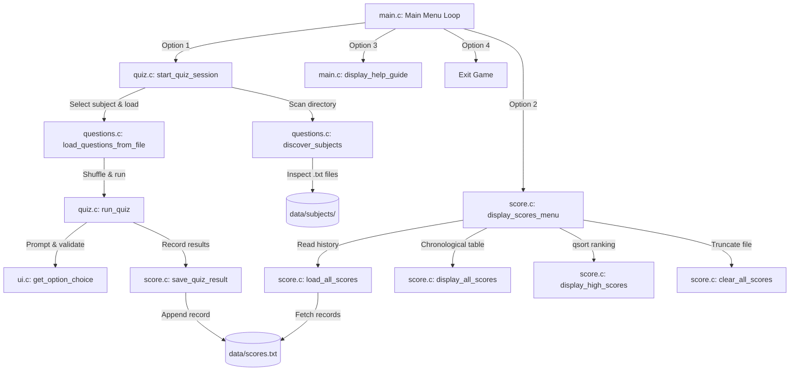

# 🎯 CLI Quiz Game in C

A modular, extensible, and feature-rich console-based multiple-choice quiz application developed in **C (C11 standard)**.


---

## 📑 Table of Contents

- [Overview](#-overview)
- [System Architecture](#-system-architecture)
- [Module Breakdown](#-module-breakdown)
- [Core Data Structures & Implementation Details](#-core-data-structures--implementation-details)
  - [1. Data Models](#1-data-models)
  - [2. Question Bank Parser](#2-question-bank-parser)
  - [3. Dynamic Subject Discovery](#3-dynamic-subject-discovery)
  - [4. Fisher-Yates Shuffle Algorithm](#4-fisher-yates-shuffle-algorithm)
  - [5. Leaderboard Ranking & Persistence](#5-leaderboard-ranking--persistence)
  - [6. Robust Terminal I/O & Memory Safety](#6-robust-terminal-io--memory-safety)
- [Build & Run Instructions](#-build--run-instructions)
  - [Prerequisites](#prerequisites)
  - [Using GNU Make (Cross-Platform)](#using-gnu-make-cross-platform)
  - [Manual Compilation (Without Make)](#manual-compilation-without-make)
- [User Guide & Gameplay Walkthrough](#-user-guide--gameplay-walkthrough)
- [Extending Question Banks (Custom Subjects)](#-extending-question-banks-custom-subjects)
- [Score Storage Schema](#-score-storage-schema)
- [C Programming Concepts Demonstrated](#-c-programming-concepts-demonstrated)
- [License](#-license)

---

## 🌟 Overview

The **CLI Quiz Game** is designed to provide an engaging, clean, and customizable quiz experience directly inside the terminal. Players can register their profiles, choose from automatically discovered subjects, optionally randomize questions, receive real-time answer feedback with explanations, view detailed performance metrics, and compete on a persistent Hall of Fame leaderboard.

### Key Capabilities
- **Dynamic Subject Loading**: Discovers questions from flat files in `data/subjects/` at runtime without requiring code changes or recompilation.
- **Immediate Answer Feedback**: Correct answers yield instant score increases; missed answers immediately reveal both the correct choice and an educational explanation.
- **Performance Evaluation**: Computes total score, correct/incorrect totals, accuracy percentage, and awards performance rating stars.
- **Persistent Leaderboard**: Stores player history to `data/scores.txt` and uses `qsort` to rank top players by score and accuracy.
- **Cross-Platform Compatibility**: Fully functional on Linux, macOS, and Windows with automatic OS detection in the build system.

---

## 🏛️ System Architecture

The application adopts a **modular design** separating user interface rendering, question bank parsing, gameplay logic, and persistence into dedicated modules.

```
Quiz-Game/
├── Makefile                # Cross-platform build automation (Linux, macOS, Windows)
├── README.md               # Comprehensive documentation
├── .gitignore              # Ignores build objects and binary artifacts
├── include/                # Header files (Type definitions & API declarations)
│   ├── quiz.h              # Core data models, constants, and quiz engine declarations
│   ├── questions.h         # Question loading and subject directory scanner
│   ├── score.h             # Persistence, chronological viewer, and leaderboard
│   └── ui.h                # ANSI terminal styling, banners, and safe I/O utilities
├── src/                    # Source implementations
│   ├── main.c              # Application entry point & interactive menu loop
│   ├── quiz.c              # Game session controller, question loop & score calculation
│   ├── questions.c         # File streaming parser and directory inspection
│   ├── score.c             # Score serialization and multi-criteria sorting
│   └── ui.c                # Screen formatting, ANSI escape sequences, input sanitization
└── data/                   # Runtime data directory (auto-created if missing)
    ├── scores.txt          # Pipe-delimited persistent history of quiz attempts
    └── subjects/           # Subject question files (.txt format)
        ├── c_programming.txt
        ├── computer_science.txt
        ├── general_knowledge.txt
        └── science.txt
```

### Component Interaction Flow



---

## 🧩 Module Breakdown

| Module | Header | Source | Primary Responsibilities |
| :--- | :--- | :--- | :--- |
| **Main Engine** | `include/quiz.h` | `src/main.c` | Top-level CLI loop, application bootstrap, help manual display, and clean program exit. |
| **Quiz Controller** | `include/quiz.h` | `src/quiz.c` | Interactive player flow, question iteration, timer/shuffle orchestration, score tracking, and scorecard generation. |
| **Question Loader** | `include/questions.h` | `src/questions.c` | Scanning `data/subjects/`, streaming file parser, delimiter handling, and bootstrapping default question banks. |
| **Score Manager** | `include/score.h` | `src/score.c` | Saving results to disk, deserializing records, chronological table formatting, and multi-key leaderboard sorting. |
| **UI & Input** | `include/ui.h` | `src/ui.c` | ANSI colors, screen clearing, custom borders, banners, string trimming, and buffer-overflow-safe input validators. |

---

## 💻 Core Data Structures & Implementation Details

### 1. Data Models

Defined in [`include/quiz.h`](include/quiz.h):

```c
typedef struct {
    char question_text[MAX_TEXT_LEN];      /* Full text of the question */
    char options[4][MAX_OPTION_LEN];       /* Four multiple-choice options (A, B, C, D) */
    int correct_option;                    /* 0 = A, 1 = B, 2 = C, 3 = D */
    char explanation[MAX_EXPLANATION_LEN]; /* Contextual explanation for the answer */
} Question;

typedef struct {
    char name[MAX_NAME_LEN];               /* Human-readable subject display name */
    char filename[MAX_PATH_LEN];           /* Relative path to the question file */
    int question_count;                    /* Total valid questions parsed from file */
} Subject;

typedef struct {
    char player_name[MAX_NAME_LEN];        /* Name of the player */
    char subject_name[MAX_NAME_LEN];       /* Subject taken */
    int total_questions;                   /* Total questions in this attempt */
    int correct_answers;                   /* Total correct selections */
    int incorrect_answers;                 /* Total incorrect selections */
    int total_marks;                       /* Final awarded marks (10 pts per correct) */
    double accuracy;                       /* Accuracy percentage (0.00% - 100.00%) */
    char timestamp[32];                    /* ISO-like formatted date/time string */
} QuizResult;
```

---

### 2. Question Bank Parser

The parser in [`src/questions.c`](src/questions.c) utilizes a state-based streaming reader. It iterates through subject files line-by-line using `fgets()`:

- **Subject Name**: Extracted from `[Subject: <Name>]` tags.
- **Field Markers**: Prefixes `Q:`, `A:`, `B:`, `C:`, `D:`, `Ans:`, and `Exp:` extract the respective attributes into a temporary `Question` struct.
- **Delimiter**: When the delimiter `---` is encountered, the question is validated (ensuring `correct_option` is in range `0..3`) and appended to the `Question` array.

```c
int load_questions_from_file(const char *filepath, Question questions[], int max_questions) {
    FILE *fp = fopen(filepath, "r");
    if (!fp) return 0;

    char line[512];
    int count = 0;
    Question current_q;
    memset(&current_q, 0, sizeof(Question));
    current_q.correct_option = -1;

    while (fgets(line, sizeof(line), fp) && count < max_questions) {
        trim(line);
        if (line[0] == '\0' || line[0] == '#') continue;

        if (strncmp(line, "Q:", 2) == 0) {
            safe_copy(current_q.question_text, sizeof(current_q.question_text), line + 2);
        } else if (strncmp(line, "Ans:", 4) == 0) {
            char ch = (char)toupper((unsigned char)(strchr(line, ':') + 1)[0]);
            current_q.correct_option = (ch >= 'A' && ch <= 'D') ? (ch - 'A') : -1;
        } else if (strncmp(line, "---", 3) == 0) {
            if (current_q.correct_option >= 0) {
                questions[count++] = current_q;
            }
            memset(&current_q, 0, sizeof(Question));
            current_q.correct_option = -1;
        }
    }
    fclose(fp);
    return count;
}
```

---

### 3. Dynamic Subject Discovery

Instead of hardcoding subjects, [`src/questions.c`](src/questions.c) uses POSIX `<dirent.h>` to inspect the `data/subjects/` folder at runtime:
1. Iterates over directory entries using `opendir()` and `readdir()`.
2. Filters files ending in `.txt`.
3. Opens each file briefly to parse the subject header and count valid questions.
4. Sorts subjects alphabetically using standard C `qsort()` for consistent menu ordering.

---

### 4. Fisher-Yates Shuffle Algorithm

To ensure high replay value, players can opt to randomize the question sequence before each quiz. Implemented in [`src/quiz.c`](src/quiz.c):

```c
static void shuffle_questions(Question arr[], int n) {
    if (n <= 1) return;
    for (int i = n - 1; i > 0; i--) {
        int j = rand() % (i + 1);
        Question temp = arr[i];
        arr[i] = arr[j];
        arr[j] = temp;
    }
}
```
This guarantees an unbiased, uniform distribution of permutations in $O(n)$ time complexity.

---

### 5. Leaderboard Ranking & Persistence

Game results are stored in `data/scores.txt` using a pipe-delimited format:
```
PlayerName|SubjectName|TotalQuestions|Correct|Incorrect|Marks|Accuracy|Timestamp
```

When displaying the **Hall of Fame**, records are deserialized into an array of `QuizResult` structures and ranked using `qsort()` with a multi-criteria comparator:

```c
static int compare_results(const void *a, const void *b) {
    const QuizResult *r1 = (const QuizResult *)a;
    const QuizResult *r2 = (const QuizResult *)b;

    /* Primary key: Total Marks descending */
    if (r2->total_marks != r1->total_marks) {
        return r2->total_marks - r1->total_marks;
    }
    /* Secondary key: Accuracy percentage descending */
    if (r2->accuracy > r1->accuracy) return 1;
    if (r2->accuracy < r1->accuracy) return -1;
    return 0;
}
```

Top records are displayed with medal highlights (🥇 Gold, 🥈 Silver, 🥉 Bronze).

---

### 6. Robust Terminal I/O & Memory Safety

To eliminate common C pitfalls (such as `scanf()` buffer pollution, newline residue, and buffer overruns):
- **Bounded Inputs**: Uses `fgets()` into sized buffers rather than unbounded `scanf("%s", ...)`.
- **Custom `safe_copy()`**: Avoids `strncpy` null-termination risks and compiler `-Wformat-truncation` warnings by ensuring absolute termination within capacity.
- **Input Sanitization**: Automatically trims leading/trailing whitespace and flushes leftover characters from `stdin`.
- **Input Flexibility**: Question choices accept both upper/lowercase letters (`A`, `a`, `B`, `b`...) or numbers (`1` $\rightarrow$ A, `2` $\rightarrow$ B...).

---

## 🛠️ Build & Run Instructions

### Prerequisites
- **C Compiler**: `gcc` (supporting C11) or `clang`
- **Build Tool**: GNU `make`

---

### Using GNU Make (Cross-Platform)

The project includes an intelligent `Makefile` with automatic OS detection (Linux, macOS, and Windows):

#### 1. Compile the Application
```bash
make
```
Compiles with strict C11 flags (`-Wall -Wextra -std=c11 -pedantic -O2 -Iinclude`) and links into the binary `quiz_game` (or `quiz_game.exe` on Windows).

#### 2. Run the Game
```bash
make run
```
*Or execute directly:*
- **Linux / macOS**: `./quiz_game`
- **Windows**: `quiz_game.exe`

#### 3. Clean Build Artifacts
```bash
make clean
```
Removes generated object files (`obj/`) and executable binaries.

---

### Manual Compilation (Without Make)

If `make` is not available on your system, you can compile all source files directly with `gcc`:

```bash
gcc -Wall -Wextra -std=c11 -pedantic -O2 -Iinclude src/*.c -o quiz_game
```

Then run:
```bash
./quiz_game
```

---

## 🎮 User Guide & Gameplay Walkthrough

### 1. Main Menu
Upon launching, the interactive menu presents four options:
```text
======================================================================
     ___  _   _ ___ _____     ____    _    __  __ _____ 
    / _ \| | | |_ _|__  /    / ___|  / \  |  \/  | ____|
   | | | | | | || |  / /    | |  _  / _ \ | |\/| |  _|  
   | |_| | |_| || | / /_    | |_| |/ ___ \| |  | | |___ 
    \__\_\\___/|___/____|    \____/_/   \_\_|  |_|_____|
======================================================================
               Test Your Skills & Challenge Your Mind!        

======================================================================
  MAIN MENU
----------------------------------------------------------------------
  1. Start a New Quiz
  2. View Scores & Leaderboard
  3. How to Play & Custom Subjects
  4. Exit

Enter your choice (1-4): 
```

### 2. Registration & Subject Selection
Enter your name, then select from the automatically loaded subjects:
```text
Welcome, Alice! Select a subject to begin:

   1. C Programming                    (10 questions)
   2. Computer Science Fundamentals    (8 questions)
   3. General Knowledge                (6 questions)
   4. Science                          (5 questions)

   0. Return to Main Menu
```

### 3. Immediate Feedback
For each question, immediate visual feedback highlights whether your answer was correct or incorrect:
```text
======================================================================
 Question 1 of 5 | Player: Alice | Subject: Science | Score: 0
======================================================================

Q1: What is the chemical symbol for Gold?

   [A] Ag
   [B] Au
   [C] Fe
   [D] Pb

Your answer (A, B, C, or D): B
----------------------------------------------------------------------
 [✓] CORRECT! (+10 marks)

 Explanation: Au comes from the Latin word 'Aurum', meaning shining dawn.
----------------------------------------------------------------------
```

### 4. Quiz Performance Report
After completing all questions, a scorecard summarizes your results:
```text
======================================================================
  QUIZ PERFORMANCE REPORT
----------------------------------------------------------------------

+--------------------------------------------------------------------+
| Player Name          : Alice                                       |
| Subject              : Science                                     |
| Date & Time          : 2026-10-06 14:40                            |
+--------------------------------------------------------------------+
| Total Questions      : 5                                           |
| Correct Answers      : 5                                           |
| Incorrect Answers    : 0                                           |
| Accuracy             : 100.00%                                     |
| Total Marks          : 50 / 50                                     |
+--------------------------------------------------------------------+
  Performance Rating: Outstanding! ★★★★★

 [✓] Score successfully saved to history.
```

### 5. Hall of Fame Leaderboard
View top scores ranked by total marks and accuracy percentage:
```text
======================================================================
  HALL OF FAME - HIGH SCORES & LEADERBOARD
----------------------------------------------------------------------
+------+--------------------+------------------------+-------+-----------+----------+-------------------+
| Rank | Player Name        | Subject                | Score | Correct   | Accuracy | Date / Time       |
+------+--------------------+------------------------+-------+-----------+----------+-------------------+
| 1    | Zawad              | C Programming          | 100   | 10/10     |  100.0%  | 2026-10-06 14:39  |
| 2    | Alice              | Science                | 50    | 5/5       |  100.0%  | 2026-10-06 14:40  |
| 3    | Bob                | Science                | 30    | 3/5       |   60.0%  | 2026-10-06 16:37  |
+------+--------------------+------------------------+-------+-----------+----------+-------------------+
```

---

## ➕ Extending Question Banks (Custom Subjects)

You can add new subjects or expand existing ones **without modifying or recompiling the C code**.

### Adding a Subject
1. Create a new `.txt` file inside `data/subjects/` (e.g., `data/subjects/world_history.txt`).
2. Populate it following this format:

```text
[Subject: World History]
# You can add comments starting with '#'

Q: In which year did the World War II end?
A: 1943
B: 1944
C: 1945
D: 1946
Ans: C
Exp: World War II ended in 1945 with the surrender of Axis forces.
---
Q: Who was the first emperor of unified China?
A: Qin Shi Huang
B: Han Wudi
C: Kublai Khan
D: Sun Yat-sen
Ans: A
Exp: Qin Shi Huang unified China in 221 BC and established the Qin dynasty.
---
```

When you launch the game, `World History` will be automatically detected and displayed in the subject selection menu!

---

## 📊 Score Storage Schema

The file `data/scores.txt` uses pipe-delimited records (`|`):

```text
PlayerName|SubjectName|TotalQuestions|Correct|Incorrect|TotalMarks|Accuracy|Timestamp
```

### Sample Data
```text
Zawad|C Programming|10|10|0|100|100.00|2026-10-06 14:39
Alice|Science|5|5|0|50|100.00|2026-10-06 14:40
Bob|Science|5|3|2|30|60.00|2026-10-06 16:37
```

---

## 🎓 C Programming Concepts Demonstrated

| Concept | Project Implementation |
| :--- | :--- |
| **Variables & Types** | Use of fixed and derived types (`int`, `double`, `char`, `bool`, `size_t`, `time_t`). |
| **Control Flow** | `switch` for menu navigation; `if-else` cascades for answer validation and grade calculations. |
| **Loops** | `while` loops for continuous user interaction; `for` loops for questions, shuffling, and table output. |
| **Modular Architecture** | Distinct compilation units (`main.c`, `quiz.c`, `questions.c`, `score.c`, `ui.c`) paired with headers. |
| **Arrays & Strings** | Matrix-like option arrays `options[4][MAX_LEN]`, string sanitization, trimming, and safe copying. |
| **Structures (`struct`)** | Complex composite data structures for `Question`, `Subject`, and `QuizResult`. |
| **File I/O** | `fopen()`, `fclose()`, `fgets()`, `fprintf()`, and directory scanning via `<dirent.h>`. |
| **Standard Algorithms** | Fisher-Yates array shuffling and multi-criteria comparison using standard `qsort()`. |
| **Memory & Input Safety** | Zero unbounded input; newline stripping, input buffer flushing, and boundary protection. |

---

## 📜 License

This project is open-source and released under the [GPL License](LICENSE).
